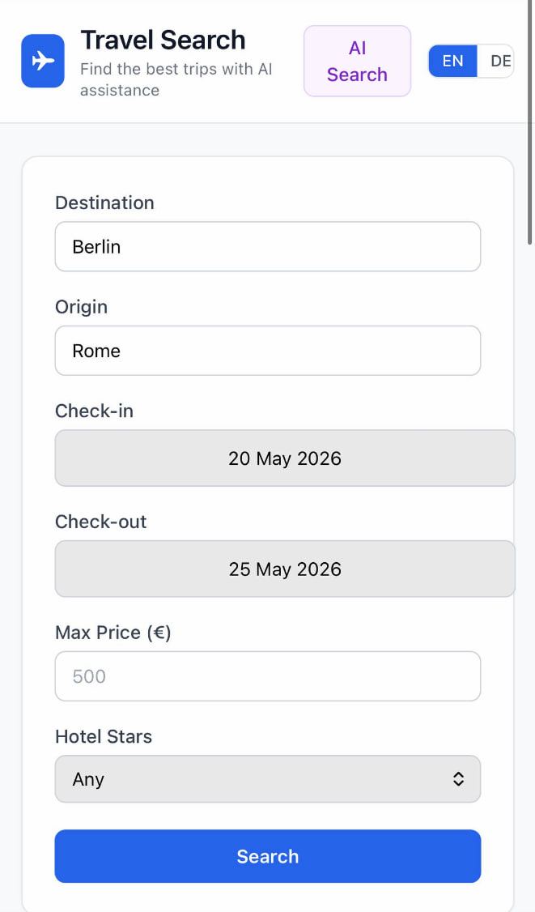
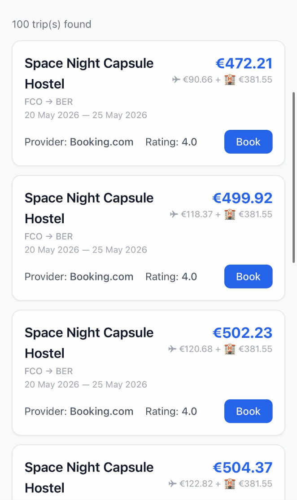

# Travel Search Aggregator 🧳

AI-powered travel search — find the best hotels and flights in one place.

## Quick Start

```bash
git clone https://github.com/CL0CK/travel_search_aggregator.git
cd travel_search_aggregator
echo "RAPIDAPI_KEY=your_key" > .env
docker compose up --build
```

## Architecture

| Component | Tech |
|---|---|
| **Frontend** | React 18 + TypeScript + Vite + Tailwind CSS |
| **API** | FastAPI + Python 3.13 |
| **Database** | PostgreSQL (optional) |
| **Cache** | Redis |
| **AI** | Ollama (phi3:mini) — runs locally, no API key needed |
| **Real data** | RapidAPI (Booking.com) |
| **CI/CD** | GitHub Actions → Render + GitHub Pages |

## Features

- **AI Search** — natural language input: *"I want to go from Berlin to Rome next week"*
  - *Note: AI search requires Ollama (`phi3:mini`) running locally. Not available on the free Render demo due to resource constraints.*
  
  

- **AI Safety Guard** — the agent validates every query. If the request is not about travel (or contains illegal/unrelated content), it returns `400` with: *"Your query doesn't seem to be about travel."*
- **Multi-language** — EN/DE, supports city names in English, German, Russian
- **Real data** — hotels and flights via Booking.com API
- **Book button** — direct link to Booking.com
- **Load more** — pagination without page reload
- **Rate limiting** — Lua-based atomic throttling
- **Ranking algorithm** — weighted scoring: `score = w₁ · price_score + w₂ · rating_score`, sorts results by best value

    

## Design Patterns

| Pattern | Where |
|---|---|
| **Strategy** | Multiple providers (Mock A/B/C, RapidAPI) implement the same `search` interface, interchangeable at runtime |
| **Adapter** | `adapters.py` normalises data from every provider into a unified `TripDTO` |
| **Dependency Injection** | Services stored in `app.state`, injected into routes via FastAPI `Depends()` |
| **Singleton** | Redis client, DB engine, session maker — created once, reused globally |
| **Factory** | `get_engine()` / `get_session_maker()` — lazy initialisation, raises only when used without DB configured |
| **Facade** | `SearchService` and `RankingService` hide the complexity of multi-provider aggregation and scoring |
| **Pipeline** | Request flows through: provider call → adapter normalisation → ranking → cached response |
| **DTO** | `TripDTO` / `TripRead` — typed data transfer objects decoupled from internal models |
| **Middleware** | Rate limiter, CORS middleware applied at the ASGI layer |

## Ranking Algorithm

Results are scored by a weighted formula in `app/services/ranking.py`:

```
score = w_price · price_score + w_rating · rating_score
```

Where:
- `price_score` — normalised inverse of total price (flight + hotel), best price → 1.0
- `rating_score` — normalised hotel rating (stars / 5), best rating → 1.0
- `w_price` / `w_rating` — configurable weights (default: 0.6 / 0.4)

All trips are sorted descending by score, so the best value appears first.

## Tests

```bash
pytest tests/ -v
```

## Project Structure

```
├── app/                # FastAPI backend
│   ├── api/routes/     # Endpoints (health, search, search_ai, extract)
│   ├── services/       # LLM, ranking, cache
│   ├── providers/      # Mock providers + RapidAPI (Booking.com)
│   └── core/           # Config, Redis, rate limiter
├── frontend/           # React + Vite
│   └── src/components/ # AIChatModal, SearchForm, Results, Header
├── screenshots/        # Demo screenshots
├── tests/              # Unit tests
├── .github/workflows/  # CI/CD pipelines
└── docker-compose.yml  # All services
```

## Environment Variables

| Variable | Description |
|---|---|
| `RAPIDAPI_KEY` | RapidAPI key for Booking.com |
| `REDIS_URL` | Redis connection string (supports Upstash TLS) |
| `DATABASE_URL` | PostgreSQL connection (optional — leave empty to skip DB) |
| `OLLAMA_HOST` | Ollama server address (default: `localhost:11434`) |

## Docker

```bash
docker compose up --build    # Start all services
docker compose down          # Stop all services
docker compose up ollama     # Download models first
```

## CI/CD

- **PR** → pytest + frontend build
- **Merge to main** → deploy API to Render + frontend to GitHub Pages

## Live Demo

- **API**: https://travel-search-aggregator.onrender.com
- **Frontend**: https://cl0ck.github.io/travel_search_aggregator/
